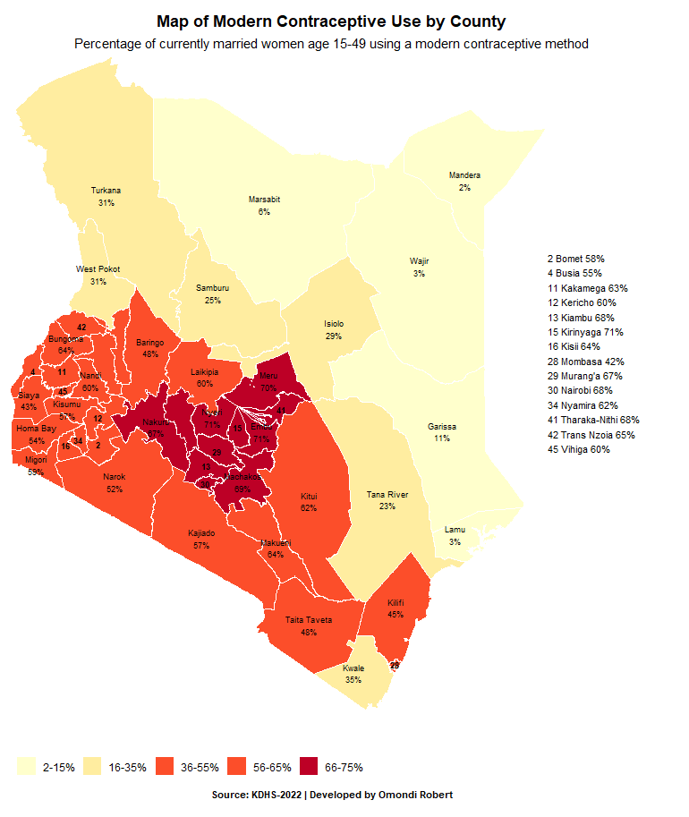

# Mapping-in-R
Mapping in R Software
# Contraceptive Use Map - Kenya Counties

This R script visualizes modern contraceptive use across Kenyan counties using a map. It merges data from KDHS 2022 with geographic data from shapefiles to create a detailed and annotated map.

---

## 🖼️ Output


---
## 📂 File Structure

- `gadm41_KEN_1.shp` — Shapefile representing the boundaries of Kenyan counties.
- `contraceptive_use_map.png` — Output PNG image showing contraceptive use across counties.
- `contraceptive_use_map.R` — The main R script to generate the plot.
- `README.md` — Documentation for this project.

---

## 📊 Objective

To illustrate the percentage of currently married women aged 15-49 using modern contraceptive methods in each Kenyan county.

---

## 🧰 Packages Used

The following R packages are required:
```r
library(ggplot2)
library(sf)
library(dplyr)
```
---
## 🗺️ Methodology
#### Load Kenyan Counties Shapefile:
The shapefile gadm41_KEN_1.shp is loaded using sf::st_read().

#### Prepare Contraceptive Data:
A data frame is manually created with county names and their respective percentages.

#### Merge Data with Shapefile:
The percentage data is joined with the shapefile's county names using dplyr::left_join().

#### Create Binned Categories:
Percentages are grouped into 5 bins (2–15%, 16–35%, 36–55%, 56–65%, 66–75%) for better visualization.

#### Handle Small Counties:
Small counties (bottom 30% by area) are given numeric labels and a separate legend.

#### Plot:
The map is created using ggplot2::geom_sf() with proper annotations, legend placement, and custom color scales.

---
## 📌 Notes
The data source is the Kenya Demographic and Health Survey (KDHS) 2022.

Counties are differentiated by both fill color (indicating usage rates) and text annotations.

Small counties are labeled numerically with a legend to the right for clarity.

